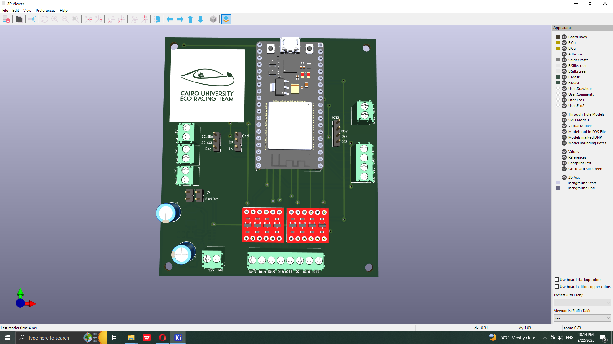
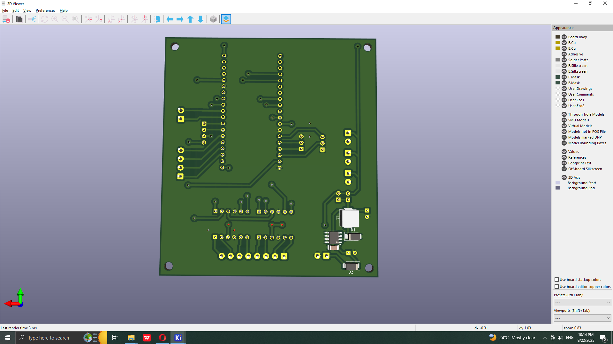

# RC NodeMcu 32s shield

* Onboard Buck Converter (12V--->5V)
* Reverse Connection protection for the 12V input 
* 8x 5V digital outputs (Level Shifted from 3.3V using BOB-12009 or similar) screw terminated
* 2x Dac outputs (IO25, IO26) screw terminated
* 4x ADC inputs   (IO35, IO34, IO39, IO36) screw terminated
* 3x 5V screw terminal (Outputs)
* I2C , Uart0 Headers

#### Warning
Never Connect usb to the esp32, while plugging in the 12V input (At least remove the buck enable header)

production : gerbers for production and bom
bom : html interactive bom
LIB : component library used
Doc : 3d model , images , schematic (pdf) , etc
